# Corn NIR Calibration Transfer - Chimiométrie robuste et Machine Learning à travers plusieurs spectromètres

*Des baselines PLS au transfert de calibration inter-instruments, sur le benchmark Corn (Cargill/Eigenvector).*

🚀 **[Démo en ligne](https://corn-nir-spectra-analysis-llw.streamlit.app/)** : essayer l'app directement dans
le navigateur, sans installation.

📄 **[Rapport complet (PDF, français)](reports/Corn_NIR_Rapport_Complet.pdf)** : méthodologie, résultats et
discussion détaillés.

📊 **[Présentation (PDF)](reports/Corn_NIR_Presentation.pdf)** : synthèse visuelle du projet.

## La question

**Peut-on prédire la composition du maïs à partir de spectres NIR, et conserver cette performance lorsqu'on change de spectromètre ?**

Ce dépôt est un benchmark reproductible et testé sur le jeu de données classique **Corn** : 80 échantillons
de maïs mesurés sur **trois** spectromètres proche infrarouge (`m5`, `mp5`, `mp6`), 1100 à 2498 nm par pas de
2 nm (700 canaux), avec quatre propriétés de référence (**Moisture, Oil, Protein, Starch**) et quelques
standards de calibration en verre NBS par instrument.

## Le jeu de données

| Variable | Dimensions | Contenu |
|---|---|---|
| `m5spec` / `mp5spec` / `mp6spec` | 80 × 700 | Spectres sur chaque instrument |
| `propvals` | 80 × 4 | Moisture, Oil, Protein, Starch |
| `m5nbs` / `mp5nbs` / `mp6nbs` | 3×700 / 4×700 / 4×700 | Standards de verre NBS par instrument |

Mesuré chez **Cargill**, distribué avec permission par **Eigenvector Research** comme benchmark pour les
méthodes de transfert de calibration inter-instruments (*EigenNews*, Vol. 1 No. 3, octobre 1999). Chaque
ligne correspond au *même échantillon physique* mesuré sur les trois instruments, ce couplage d'identité
est préservé partout dans l'analyse (jamais séparé entre train/test comme s'il s'agissait d'échantillons
indépendants).

## Structure du dépôt

```
data/raw/corn.mat            fichier original, jamais modifié
src/corn_nir/                 toute la logique réutilisable : chargeur, prétraitements, modèles,
                               validation (dont la validation croisée leave-one-out imbriquée),
                               sélection de variables, transfert de calibration, évaluation,
                               visualisation, et experiments.py qui orchestre chaque phase sous forme
                               de fonctions, importées par les
                               notebooks et par l'app Streamlit
notebooks/                    narration (en français):
                                 01_audit_eda.ipynb                     audit, diagnostic de
                                                                        déformation, choix du point
                                                                        de départ, ACP
                                 02_prediction_intra_instrument.ipynb   baseline PLSR, comparaison de
                                                                        prétraitements, VIP/Elastic
                                                                        Net, comparaison à des
                                                                        modèles ML
                                 03_transfert_inter_instruments.ipynb   robustesse inter-instruments,
                                                                        transfert de calibration
app/streamlit_app.py          démo interactive (en anglais ; le reste du projet est en français) :
                               explorateur de spectres, superposition VIP, spectres colorés par
                               propriété cible, ajustement de modèle interactif. Calcule tout à la
                               volée sur les mêmes fonctions que les notebooks
reports/figures/               figures exportées par les notebooks (PNG)
reports/results/               tableaux exportés par les notebooks (CSV)
reports/Corn_NIR_Rapport_Complet.pdf   rapport complet en français
reports/Corn_NIR_Presentation.pdf      présentation
tests/                         tests unitaires

```

## Installation et reproduction

```bash
pip install -r requirements.txt
# ou : pip install -e ".[dev]"

jupyter lab notebooks/                        # exécuter les 3 notebooks dans l'ordre
streamlit run app/streamlit_app.py            # démo interactive
pytest                                        # 80 tests
```

Chaque notebook s'exécute indépendamment (il recharge les données au besoin) et écrit ses propres figures
dans `reports/figures/` et tableaux dans `reports/results/` au fil de l'exécution, sans script séparé à
lancer avant ou après. Le notebook 2 est le plus long à exécuter (validation croisée leave-one-out
imbriquée sur plusieurs prétraitements et modèles) : compter 20 à 30 minutes sur un CPU de portable ; les
notebooks 1 et 3 s'exécutent en quelques minutes.

## Méthodologie

**Protocole anti-fuite** (utilisé partout) : chaque étape de prétraitement qui apprend un paramètre (un
scaler, un spectre de référence MSC, un nombre de composantes) est ajustée uniquement sur le pli
d'entraînement, à l'intérieur d'une `Pipeline` scikit-learn. Le nombre de composantes PLS est choisi par
**validation croisée leave-one-out (LOO) imbriquée** (`src/corn_nir/validation.py`, fonction
`nested_loo_plsr`) : pour chacun des 80 échantillons laissés de côté tour à tour, une validation croisée
interne (sur les 79 restants seulement, règle du 1-écart-type) choisit le nombre de composantes. Cet
échantillon n'influence donc jamais le choix qui le concerne, seul le résidu qu'il produit une fois prédit
compte pour le résultat final. Avec seulement 80 échantillons, la LOO utilise chaque échantillon comme
validation exactement une fois sans jamais réserver de jeu de test séparé, qui laisserait trop peu
d'échantillons pour calibrer un modèle à plusieurs centaines de variables colinéaires.

**Diagnostic avant modélisation** : plutôt que de comparer des prétraitements à l'aveugle dès le départ, le
projet identifie d'abord le type de déformation spectrale (EDA, visuelle puis quantifiée), en déduit un
point de départ défendable, puis confronte ce choix à l'ensemble des alternatives dans une comparaison
empirique dédiée. Le détail est développé dans la section EDA ci-dessous (sources en
[Références](#références)).

### A/B : Audit des données et EDA

`src/corn_nir/data.py` valide les dimensions, l'axe des longueurs d'onde (`1100:2500:2` =
700 canaux) et l'absence de valeurs manquantes. EDA (`notebooks/01_audit_eda.ipynb`) :

| | |
|---|---|
| 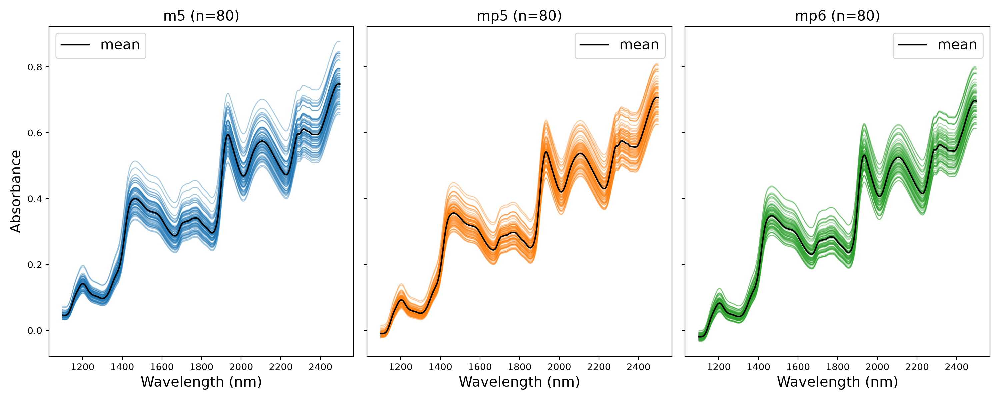 | 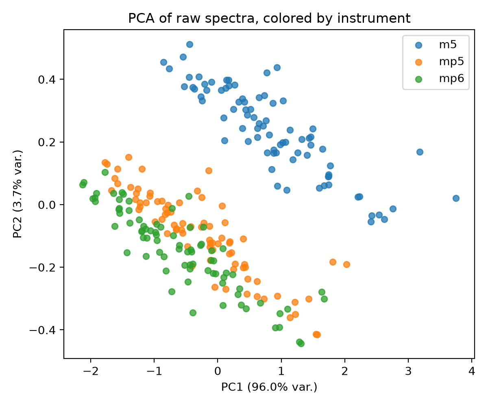 |

**Étape 1, identifier la déformation à l'œil d'abord.** Le spectre moyen de `m5` (courbe noire ci-dessus)
montre une tendance croissante avec la longueur d'onde, signe d'un effet additif. Cette tendance de fond
n'est pas due à la chimie du maïs : elle vient de la diffusion de la lumière par l'échantillon. La chimie,
elle, se manifeste par les pics d'absorption superposés à cette tendance croissante. Une lecture purement
visuelle a cependant ses limites : une ligne de base croissante peut *ressembler* à un effet multiplicatif
au premier coup d'œil, d'où l'étape suivante, quantitative plutôt qu'à l'œil.

Une ACP sur les spectres bruts poolés (3 instruments) est dominée par une seule composante
(**PC1 = 96,0%** de la variance, PC2 = 3,7%) qui reflète surtout le décalage entre instruments plutôt que
la chimie, un motif NIR classique (les effets de ligne de base et de diffusion dominent l'ACP sur spectres
bruts). Le décalage moyen entre instruments est de 0,044 unité d'absorbance (`m5`-`mp5`) et 0,056
(`m5`-`mp6`). Protein et Starch sont fortement anti-corrélés (r = −0,80), cohérent avec la biochimie du
grain de maïs.

**Étape 2, quantifier le type de déformation** : on trace chaque valeur de spectre en fonction de la
valeur du spectre moyen à la même longueur d'onde. Un effet purement additif (un décalage constant par
échantillon, indépendant du niveau) donne un nuage en « millefeuille », des bandes parallèles à la
diagonale y=x. Un effet purement multiplicatif (un facteur d'échelle par échantillon) donne un nuage en
« cône », l'écart-type du résidu croît avec le niveau du spectre moyen.

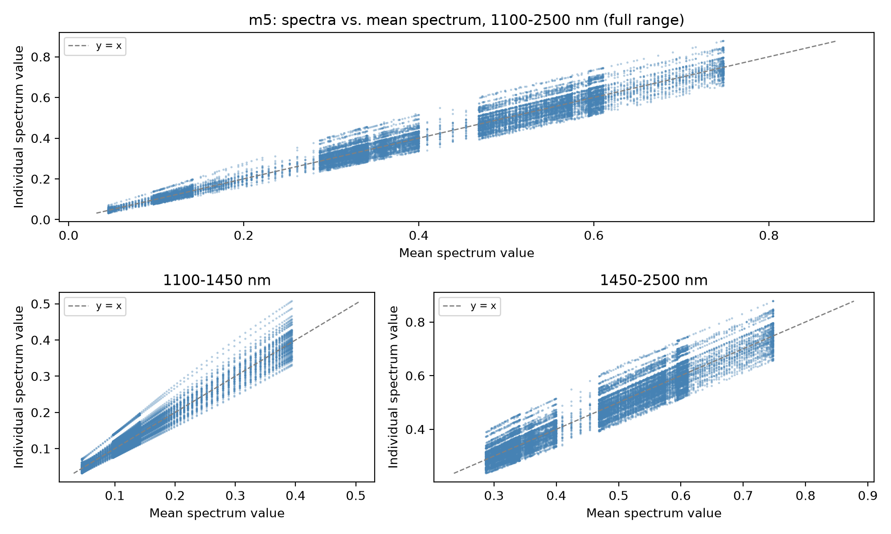

Sur l'ensemble de la plage (1100-2500 nm, graphique du haut), la forme ne permet pas de trancher
franchement. En séparant par plage de longueurs d'onde, la réponse devient nette : sur 1100-1450 nm, le
nuage s'évase nettement en partant d'un point resserré près de l'origine (un cône, signature multiplicative)
; sur 1450-2500 nm, les points restent regroupés en bandes de largeur à peu près constante le long de la
diagonale (un millefeuille, signature additive). L'effet multiplicatif n'est donc pas une propriété globale
du spectre `m5` : il est concentré sur la région 1100-1450 nm, tandis que le reste du spectre est dominé par
un effet additif.

**Étape 3, vérifier si la déformation porte du signal ou juste du bruit**, en colorant les spectres bruts
par la valeur de chaque cible à prédire :

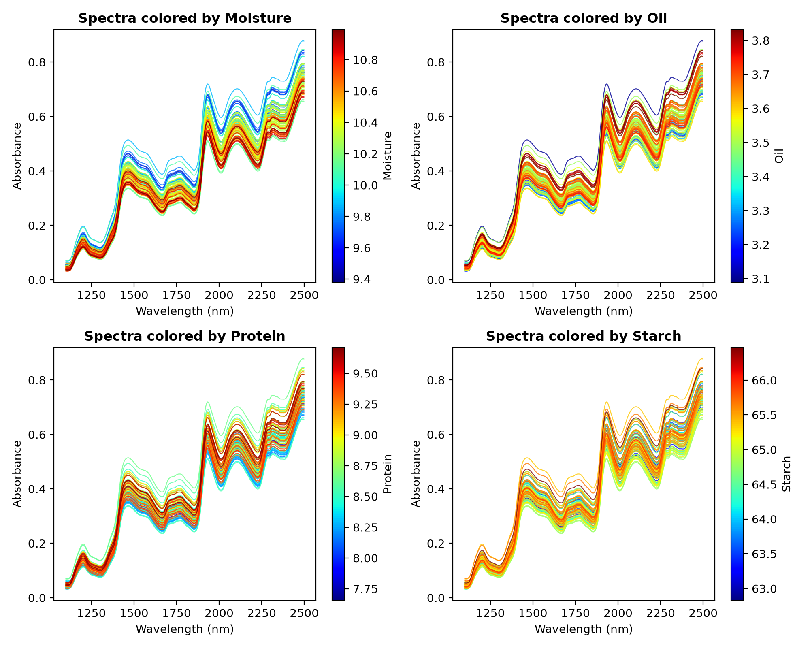

Un dégradé de couleur visible le long du niveau du spectre (net pour Moisture et Oil, mélangé sans
stratification claire pour Protein/Starch) indique que le niveau global du spectre, pas seulement sa forme
fine, covarie avec la cible pour Moisture et Oil. Après SNV (qui corrige à la fois l'effet additif et
l'effet multiplicatif), ce dégradé disparaît sur les 4 figures à la fois : SNV retire le niveau global du
spectre, la même chose pour toutes les cibles. Mais la conséquence diffère selon ce que ce niveau portait
comme information : coûteuse pour Moisture et Oil, où le niveau portait un vrai signal ; presque neutre
pour Protein et Starch, où il n'en portait déjà pas. C'est cohérent avec la Phase D plus bas, où SNV dégrade
Moisture d'un facteur ×8,4 mais laisse Protein/Starch presque intacts.

**Étape 4, choisir un point de départ justifié par ce diagnostic.** Sur la région additive dominante
(1450-2500 nm, la majorité des 700 canaux), un correcteur plus spécifique que SNV suffit : `Detrend`
(Barnes, Dhanoa & Lister, 1989) soustrait, par échantillon, la droite de régression du spectre contre la
longueur d'onde, sans re-échelonner l'amplitude comme SNV/MSC, inutile ici puisque l'effet multiplicatif
est concentré ailleurs (1100-1450 nm, hors de cette plage). La coupure à 1450 nm doit précéder l'ajustement
de `Detrend`, pas le suivre : une régression par moindres carrés est influencée par tous les points qu'elle
voit, donc ajuster sur les 700 canaux puis ne garder que 1450-2500 nm après coup laisserait la région
multiplicative exclue influencer la droite de base ajustée.

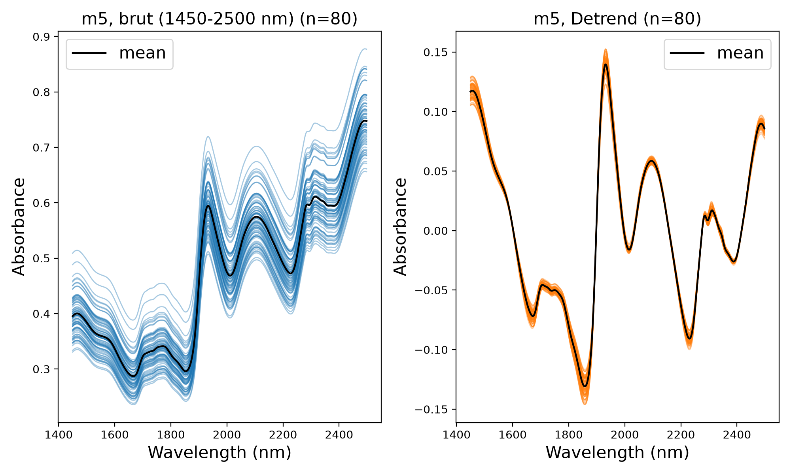

Après `Detrend`, les spectres se superposent en une bande étroite avec des extrema nets et reconnaissables
: une chute marquée vers 1850-1870 nm suivie d'un pic net vers 1920-1950 nm (la bande O-H de l'eau), puis
des pics plus petits vers 2100 et 2300-2320 nm, une forme visuellement plus lisible que le faisceau brut.

Point de départ retenu : **`Detrend`, sur 1450-2500 nm** (525 des 700 canaux). Deux réserves, prévues comme
travail à suivre et non encore réalisées. D'une part, la coupure à 1450 nm retire la bande O-H de l'eau vers
1450-1500 nm, ce qui devrait coûter cher à Moisture spécifiquement (les bandes de Oil/Protein/Starch selon
la littérature se situent surtout au-delà de 1500 nm), une coupure à 1500 nm n'a pas encore été testée
mais serait une piste à explorer pour ce sous-groupe de cibles. D'autre part, la comparaison empirique de la
Phase D (plus bas) continue de tester la plage complète (1100-2500 nm) avec les 7 prétraitements existants
(brut compris), sans inclure `Detrend` : le choix fait ici n'est qu'un point de départ justifié, pas une
décision finale.

Une ACP sur `Detrend` retient 3 composantes pour 95% de variance (86%/7%/3%), contre plusieurs dizaines
sur les données brutes, signe que `Detrend` retire une source de variance dominante sans ajouter de bruit.
Les scores corrèlent avec plusieurs cibles (PC1 avec Moisture, r=0,71, et Oil, r=−0,36 ; PC3 avec Moisture,
r=0,55, et Oil, r=−0,53 ; PC2 avec Protein, r=−0,47) : même non supervisée, l'ACP recoupe partiellement
l'information chimique pour ces cibles.

### C : Baseline PLSR intra-instrument

PLSR sur `m5` prétraité avec **`Detrend`** (point de départ justifié par le diagnostic ci-dessus),
composantes choisies par validation croisée **leave-one-out imbriquée**, **`max_components=10`** :

| Cible | RMSE (LOO) | R² (LOO) | RPD (LOO) | Composantes (mode, plage) |
|---|---|---|---|---|
| Moisture | 0,049 | 0,983 | 7,7 | 9 (8-10) |
| Oil | 0,061 | 0,880 | 2,9 | 10 (8-10) |
| Protein | 0,090 | 0,967 | 5,5 | 9 (8-9) |
| Starch | 0,265 | 0,894 | 3,1 | 7 (6-10) |

**Pourquoi `max_components=10` et pas plus.** Même avec la règle du 1-écart-type, la courbe RMSE-CV ne
plafonne pas naturellement sur ce jeu de données (avec 525 canaux très colinéaires et environ 80
échantillons, elle continue de descendre doucement dans les plages testées). Le plafond de 10 vient donc de
deux ancrages externes plutôt que d'un coude détecté dans la courbe : la règle empirique courante en
chimiométrie recommandant au moins 10 échantillons par dimension du modèle, appliquée à nos environ 79
échantillons d'entraînement par itération LOO, et le plafond utilisé dans la littérature sur ce même jeu
de données (Cataltas & Tutuncu, 2023, voir Phase D pour la comparaison chiffrée).

**Exception attendue, pas une anomalie : Moisture.** `raw` (Phase D, plus bas) fait *mieux* que ce point de
départ pour Moisture (RMSE 0,019 contre 0,049), cohérent avec l'étape 3 ci-dessus : pour cette cible
spécifiquement, le signal utile loge en bonne partie dans le niveau/l'échelle du spectre, exactement ce que
`Detrend` retire. C'est donc `raw`, testé comme une des 7 alternatives de la Phase D (pas comme
prétraitement par défaut), qui l'emporte pour Moisture. Le point de départ retenu n'avait pas vocation à
être optimal partout, seulement à être un candidat défendable a priori.

### D : Comparaison des prétraitements

La Phase C a fixé un point de départ justifié (`Detrend`) à partir du diagnostic ; cette phase le confronte
empiriquement à 7 autres variantes, avec le même moteur de validation croisée leave-one-out imbriquée
(`src/corn_nir/preprocessing.py`) : raw, mean-centering, SNV, MSC, Savitzky-Golay lissage / 1ʳᵉ dérivée /
2ᵉ dérivée (fenêtre=13, poly=2 pour lissage/1ʳᵉ dérivée ; fenêtre=17, poly=3 pour la 2ᵉ dérivée, fixées par
convention).

| Cible | Meilleur prétraitement | RMSE | R² | RPD |
|---|---|---|---|---|
| Moisture | `raw`/`mean_center` | 0,019 | 0,998 | 20,5 |
| Oil | `sg_deriv2` | 0,030 | 0,971 | 5,9 |
| Protein | `sg_deriv1` | 0,093 | 0,965 | 5,4 |
| Starch | `sg_deriv2` | 0,228 | 0,922 | 3,6 |

`raw` et `mean_center` donnent des résultats quasi identiques (PLSR centre déjà en interne), un test de
cohérence intégré, pas une vraie comparaison. `SNV`/`MSC` dégradent la performance sur chaque cible (le
plus spectaculairement pour Moisture), contraire à la pratique NIR courante mais cohérent avec le
diagnostic ci-dessus. Les dérivées Savitzky-Golay sont la seule famille qui améliore sur `raw` pour
Oil/Protein/Starch. Face au point de départ `Detrend` de la Phase C, un des 7 fait mieux pour Oil et
Starch (facteur environ 2), mais pour Protein, `Detrend` (0,090) et le meilleur des 7 ici (`sg_deriv1`,
0,093) sont quasiment à égalité, un écart de 3%, à lire comme une observation plutôt que comme un signal de
changer de prétraitement pour cette cible.

**Comparaison à la littérature sur ce même jeu de données.** Cataltas & Tutuncu (2023, *PeerJ Computer
Science*) étalonnent un PLSR conventionnel sur `m5` (spectres bruts, split 60 cal / 20 test, recherche de
composantes plafonnée à 10) :

| | Cataltas & Tutuncu 2023 (PLSR brut, split 60/20, LV≤10) | Ce projet, `raw` (LOO imbriqué, LV≤10) |
|---|---|---|
| Moisture RMSE | 0,0245 | **0,019** |
| Moisture R² | 0,9957 | 0,998 |

Les deux chiffres sont du même ordre de grandeur, malgré des protocoles de validation différents (split
unique contre LOO), cohérent avec un signal réel plutôt qu'un effet propre à notre seul protocole.

### E : Sélection de variables et interprétabilité

Scores VIP (Wold et al.) et coefficients PLS sur le meilleur prétraitement de chaque cible
(`src/corn_nir/variable_selection.py`), plus une alternative de sélection parcimonieuse (Elastic Net,
évaluée par le même protocole leave-one-out imbriqué) :

| | |
|---|---|
| 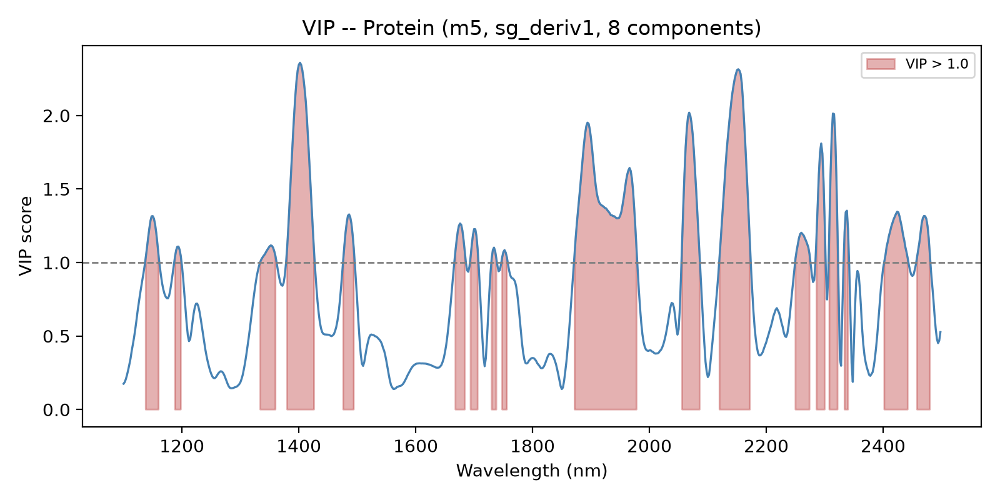 | 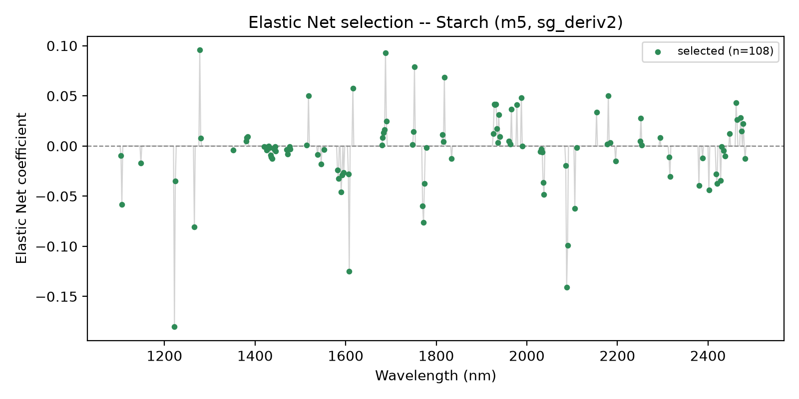 |

Comparé à **Fatemi, Singh & Kamruzzaman (2022)**, vérifié via deux sources indépendantes (Semantic
Scholar, Illinois Experts), nos longueurs d'onde VIP>1 recouvrent partiellement leurs bandes informatives
rapportées (9 à 23% de nos longueurs d'onde sélectionnées par VIP tombent dans leurs bandes cibles plus
étroites ; pas forcé à concorder, puisque VIP>1 et leur sélection VIP+algorithme génétique répondent à des
questions différentes).

**Résultat notable, sous un protocole rigoureux (pas de fuite entre sélection et évaluation)** : Elastic Net
dépasse nettement PLSR pour Protein (RMSE=0,047 contre 0,090, quasiment deux fois meilleur) et Starch
(0,192 contre 0,228), reste légèrement en retrait pour Oil (0,034 contre 0,030), et perd nettement pour
Moisture (0,062 contre 0,019). Cet avantage pour Protein/Starch survit à la LOO imbriquée, ce n'est donc pas
qu'un effet d'optimisme de validation croisée à petit n. Une explication plausible : la sélection
parcimonieuse d'Elastic Net (51 à 124 longueurs d'onde retenues selon la cible, contre les 525-700 canaux
vus par la PLS) réduit la dimensionnalité effective, ce qui aide quand le signal utile est concentré sur peu
de bandes (Protein, Starch) mais pas quand il dépend du niveau global du spectre (Moisture).

### F : Comparaison de modèles ML

Ridge, SVR-RBF, Random Forest, Gradient Boosting (`src/corn_nir/models.py`), chacun sur le meilleur
prétraitement de sa cible, même protocole leave-one-out imbriqué (Random Forest/Gradient Boosting utilisent
des hyperparamètres fixes sous LOO plutôt qu'une recherche interne à chacune des 80 itérations, voir
`make_ml_pipeline_factory_loo` : une recherche complète à chaque itération n'aurait pas été un usage
proportionné du temps de calcul pour le gain attendu à cette taille d'échantillon) :

| Cible | Meilleur modèle | RMSE | R² |
|---|---|---|---|
| Moisture | Ridge | 0,007 | 0,9997 |
| Oil | Ridge | 0,029 | 0,973 |
| Protein | Ridge | 0,030 | 0,996 |
| Starch | Ridge | 0,164 | 0,960 |

Les modèles non linéaires (SVR, Random Forest, Gradient Boosting) sous-performent systématiquement les
méthodes linéaires (PLSR, Ridge) sur chaque cible, réponse claire à la question méthodologique centrale
du projet : sur 80 échantillons, la flexibilité supplémentaire des modèles non linéaires ne paie pas. Ridge
devance PLSR sur les 4 cibles, le plus nettement pour Protein (0,030 contre 0,090) et Starch (0,164 contre
0,228), cohérent avec le constat similaire d'Elastic Net en Phase E : une régularisation linéaire bien
choisie semble mieux exploiter ce jeu de données que la PLS elle-même pour ces deux cibles spécifiquement.
Une piste naturelle pour la suite serait d'essayer d'autres méthodes de sélection de variables au-delà
d'Elastic Net (CovSel ou SelectKBest, pensé pour des données colinéaires), pas testé dans ce projet.

### G : Robustesse inter-instruments (sans correction)

Le modèle entraîné sur `m5` appliqué tel quel (sans aucune correction) à `mp5`/`mp6` :

| Cible | RMSE intra-instrument (m5) | RMSE inter-instrument (mp5 / mp6) | R² inter-instrument (mp5 / mp6) |
|---|---|---|---|
| Moisture | 0,019 | 1,46 / 1,55 | **−13,9** / **−15,9** |
| Oil | 0,030 | 0,28 / 0,18 | **−1,6** / **−0,05** |
| Protein | 0,093 | 0,80 / 0,95 | **−1,6** / **−2,7** |
| Starch | 0,228 | 1,39 / 0,59 | **−1,9** / **+0,49** |

La performance **s'effondre** sur la plupart des combinaisons cible/instrument (R² très négatif, pire
qu'une simple moyenne) dès que l'instrument change. Deux exceptions partielles : Oil/mp6 reste proche de
zéro et Starch/mp6 devient même légèrement positif (RPD=1,40), toujours bien en dessous du seuil usuel
d'utilisabilité (RPD≥2), pas un contre-exemple à la conclusion générale. C'est la motivation centrale du
transfert de calibration, et ça confirme directement que la performance en domaine de Moisture (Phase C) ne
reflète pas un signal chimique transférable.

### H : Transfert de calibration (DS / PDS / SBC)

Trois méthodes, apprises sur 25 échantillons de maïs sélectionnés par Kennard-Stone par instrument et
évaluées sur les 55 restants (jamais utilisés pour ajuster la transformation) : **Direct Standardization**
et **Piecewise DS** (`src/corn_nir/calibration_transfer.py`) corrigent les spectres avant prédiction ;
**Slope and Bias Correction (SBC)**, la méthode la plus simple des trois avec 2 paramètres, corrige
directement la prédiction du modèle non corrigé.

| Cible | Sans correction | DS | PDS | **SBC** |
|---|---|---|---|---|
| Moisture | RMSE 1,47 (R² −18,5) | **RMSE 0,17 (R² 0,75)** | RMSE 0,29 (R² 0,16) | RMSE 0,22 (R² 0,56) |
| Oil | RMSE 0,24 (R² −0,8) | RMSE 0,12 (R² 0,56) | RMSE 0,70 (R² −14,8) | **RMSE 0,08 (R² 0,81)** |
| Protein | RMSE 0,87 (R² −1,8) | RMSE 0,18 (R² 0,89) | RMSE 0,55 (R² −0,1) | **RMSE 0,13 (R² 0,94)** |
| Starch | RMSE 0,97 (R² −0,6) | RMSE 0,42 (R² 0,73) | RMSE 1,64 (R² −3,1) | **RMSE 0,31 (R² 0,86)** |

| Sans correction | Corrigé DS | Corrigé PDS | Corrigé SBC |
|---|---|---|---|
| 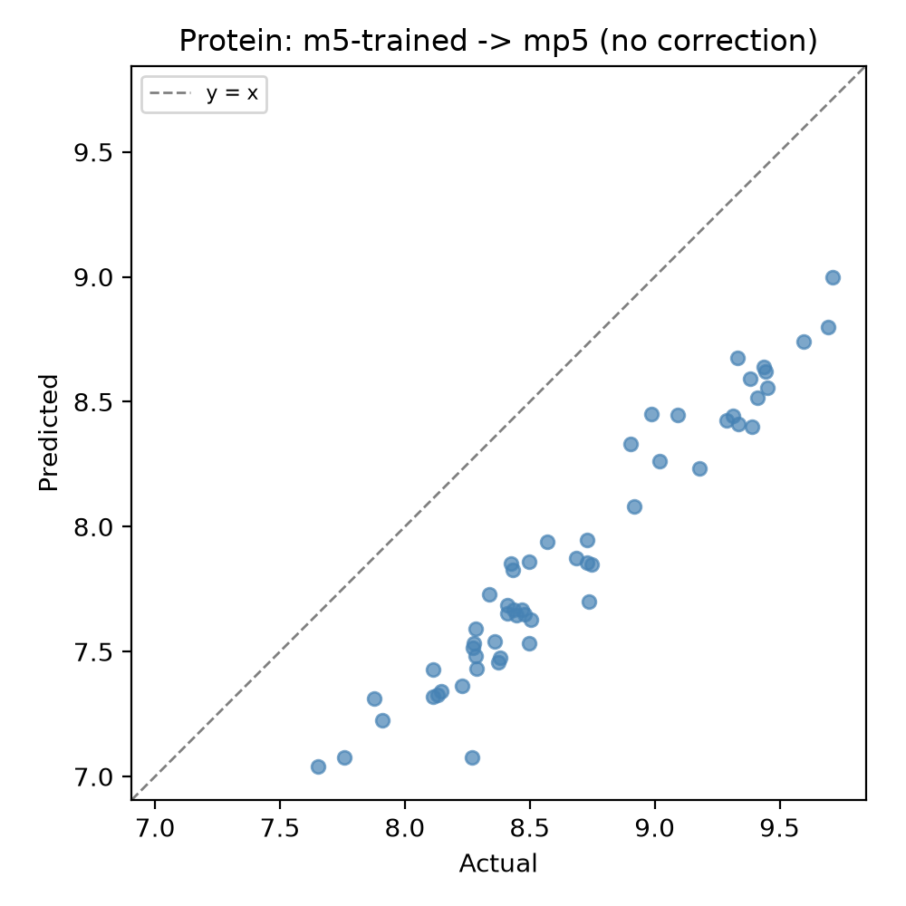 | 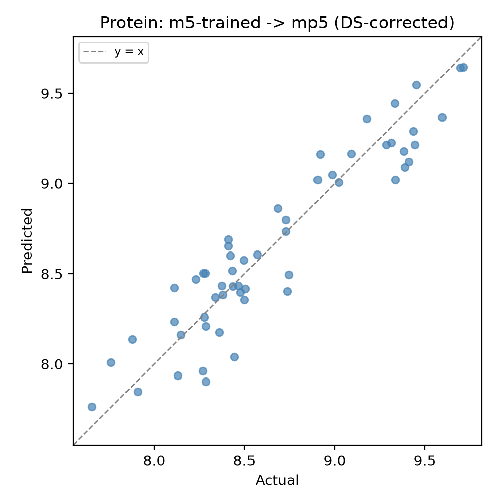 | 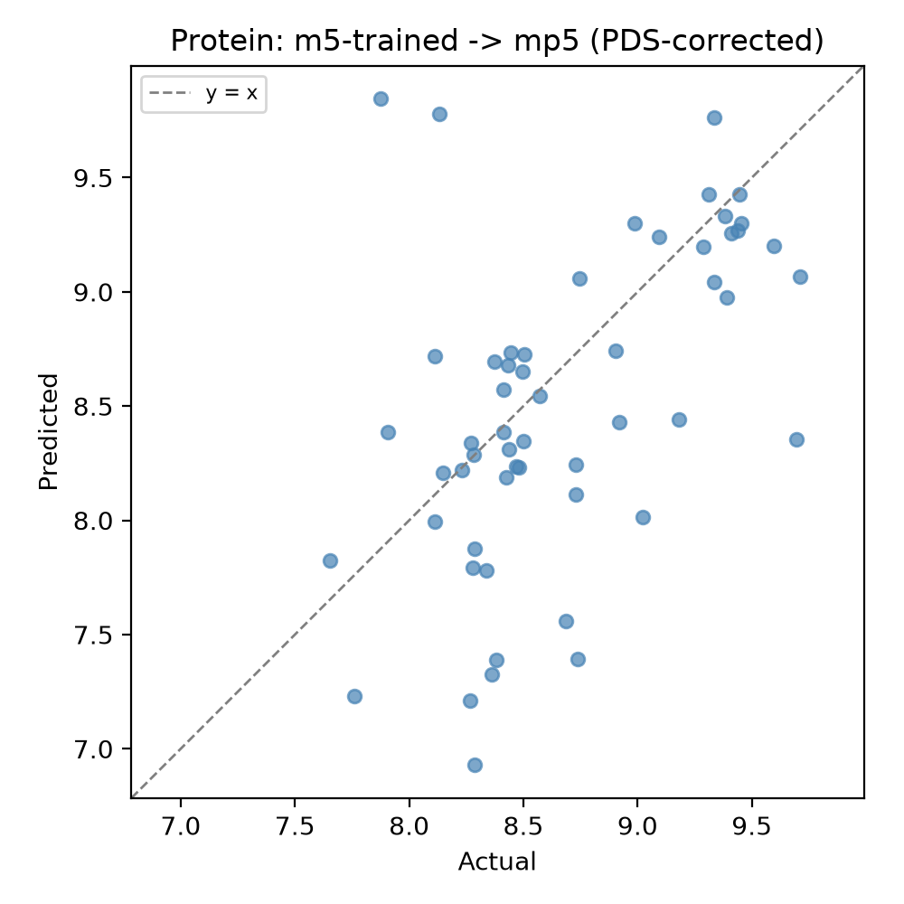 | 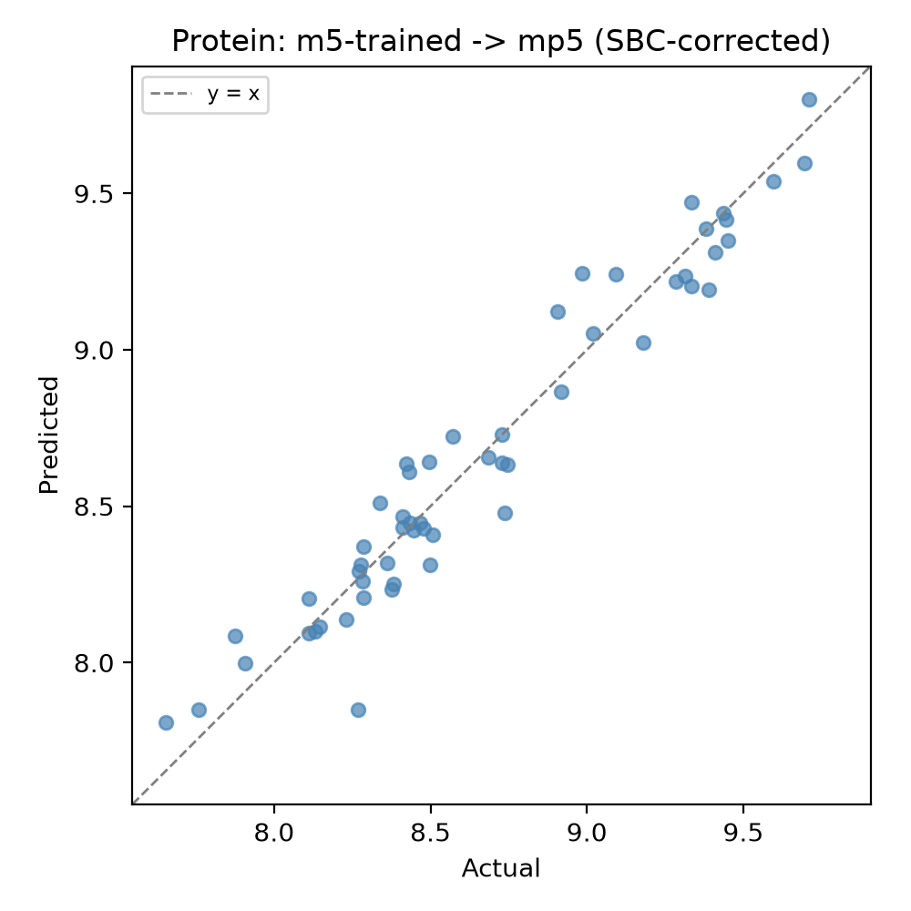 |

**Résultat notable : SBC, la méthode la plus simple, devance DS pour Oil, Protein et Starch.** Seule
Moisture fait exception, où DS reste meilleure. La PDS (une régression PLS indépendante par longueur d'onde
sur une fenêtre de 11 points) est systématiquement la moins bonne des trois, parfois pire que l'absence de
correction. Un même diagnostic explique les deux constats : DS et PDS corrigent les spectres bruts, mais
cette correction n'est jamais parfaite sur seulement 25 échantillons de transfert, il reste toujours un
résidu. Pour Oil/Protein/Starch, le meilleur prétraitement est une *dérivée* Savitzky-Golay, qui amplifie
justement ce type de résidu haute fréquence (le plus fortement pour PDS, dont les fenêtres locales ne sont
pas contraintes à la cohérence entre elles ; plus modérément pour DS). Pour Moisture (prétraitement `raw`,
pas de dérivée), ce résidu n'est pas amplifié, et la correction plus riche de DS (jusqu'à 10 composantes
PLS, contre 2 paramètres pour SBC) peut alors faire mieux. SBC, en corrigeant directement la prédiction
plutôt que le spectre, ne souffre pas de cet effet d'amplification, ce qui explique son avantage
précisément sur les cibles à dérivée. Recommandation empirique : SBC par défaut, DS pour Moisture
spécifiquement.

Une tentative exploratoire de DS à partir des seuls standards de verre NBS (plutôt que des échantillons de
maïs) s'est révélée bien pire que l'absence de correction (RMSE jusqu'à 230). Deux limites qui se cumulent :
seulement 3 standards appariés utilisables (`m5nbs` en a 3, `mp5nbs`/`mp6nbs` en ont 4, écart de comptage
inexpliqué, donc l'appariement utilisé est une hypothèse positionnelle naïve, non vérifiée), et le verre a
une matrice optique fondamentalement différente du maïs. Conservé dans les résultats pour la transparence,
pas comme méthode utilisable.

### Démo Streamlit

**[À essayer en ligne](https://corn-nir-spectra-analysis-llw.streamlit.app/)**, ou en local avec
`streamlit run app/streamlit_app.py`. `app/streamlit_app.py`, trois onglets : présentation du projet,
exploration des spectres (superposition VIP, spectres colorés par propriété cible pour retrouver
visuellement le diagnostic de la Phase A/B) et ajustement interactif d'un modèle sur un split Kennard-Stone
reproductible, avec résultat immédiat. Tout est calculé sur les mêmes fonctions que les notebooks, rien
n'est lu d'un rapport pré-calculé. Rédigée en anglais.

## Tableau récapitulatif

| Cible | Meilleur prétraitement (Phase D) | Meilleur modèle (Phase F) | LOO RMSE / R² | Inter-instrument (sans corr., moy.) | Après correction (méthode) |
|---|---|---|---|---|---|
| Moisture | raw | Ridge | 0,007 / 0,9997 | RMSE 1,51 (R² −14,9) | RMSE 0,17 (DS) |
| Oil | sg_deriv2 | Ridge | 0,029 / 0,973 | RMSE 0,23 (R² −0,8) | RMSE 0,08 (SBC) |
| Protein | sg_deriv1 | Ridge | 0,030 / 0,996 | RMSE 0,87 (R² −2,1) | RMSE 0,13 (SBC) |
| Starch | sg_deriv2 | Ridge | 0,164 / 0,960 | RMSE 0,97 (R² −0,6) | RMSE 0,31 (SBC) |

## Limitations

- **n = 80.** Chaque métrique ci-dessus est une moyenne sur les 80 itérations leave-one-out, jamais une
  valeur ponctuelle sur un seul split.
- Le RPD élevé de Moisture en domaine (Phase C/D) reste une propriété réelle de ce jeu de données/instrument
  précis, pas représentative de la prédiction NIR de l'humidité en général : les résultats
  inter-instruments (Phase G) montrent qu'elle ne transfère pas.
- La PDS sous-performe la DS et la SBC ici spécifiquement à cause d'une interaction avec les prétraitements
  en dérivée (voir Phase H), ce n'est pas une affirmation générale que la PDS est pire en transfert de
  calibration NIR.
- Aucune métadonnée de lot/conditions de mesure n'est disponible, une partie de la variance attribuée à
  l'instrument ou à l'échantillon pourrait être confondue avec des conditions de mesure non enregistrées.
- Le deep learning (CNN 1D, Transformer spectral) n'a intentionnellement **pas** été construit comme
  modèle principal : avec 80 échantillons, une baseline PLSR/Ridge bien validée est plus crédible qu'un
  modèle profond impressionnant mais instable. Choix de portée délibéré, pas un oubli.
- Le transfert de calibration basé sur les seuls standards NBS n'est pas fiable ici (voir Phase H), ne pas
  lire les chiffres DS/SBC à partir d'échantillons de maïs comme validés pour un protocole de transfert par
  verre standard seul.
- **Biais de sélection du prétraitement (Phase D), non corrigé délibérément.** Le prétraitement gagnant
  par cible est choisi comme le minimum de RMSE parmi 7 variantes testées sur le même protocole, puis ce
  choix est réutilisé tel quel dans les Phases E à H : un biais d'optimisme classique, puisque le gagnant a
  une chance non négligeable de gagner en partie par bruit d'échantillonnage sur 80 échantillons. Documenté
  ici comme limitation connue plutôt qu'implémenté : avec seulement 80 échantillons, le coût en puissance
  statistique d'une correction (jeu-test verrouillé, ou CV imbriquée à deux niveaux incluant le choix du
  prétraitement) a semblé l'emporter sur le gain de rigueur pour ce projet.
- **Fenêtre Savitzky-Golay** : fixée par convention (`window_length=13`/`17`, `preprocessing.py`), pas
  optimisée par cible, un réglage par cible risquerait de sur-ajuster une seule propriété au détriment
  des trois autres.
- **Detrend (ordre 1) n'est pas dans les 7 variantes de prétraitement comparées en Phase D.** Distinct de
  `mean_center` (une constante, pas une droite de régression contre la longueur d'onde), des dérivées SG
  (fenêtre locale, pas un ajustement global) et de SNV/MSC (qui corrigent aussi l'échelle), retenu comme
  point de départ (Phase C) sur la base du diagnostic EDA, pas encore ajouté à la comparaison à 7 variantes
  elle-même.

## Tests

```bash
pytest
```

80 tests couvrant le chargement des données, les transformateurs de prétraitement (sécurité anti-fuite), les métriques
d'évaluation, la validation croisée (leave-one-out imbriquée, la règle du 1-écart-type), la sélection de
variables (VIP), le transfert de calibration (DS/PDS/SBC), l'ACP partagée entre les figures de
scores/loadings, les modèles, les fonctions d'orchestration de `experiments.py` (y compris qu'elles ne
touchent jamais le disque), et des tests de fumée pour les visualisations.

## Références

**Matériel pédagogique** (CheMOOCs, licence CC-BY-SA), a motivé plusieurs choix méthodologiques du
projet ; Grain 5 et 10 utilisent le même jeu de données Corn/Eigenvector que ce projet :

- Roger, J.-M., & Ecarnot, M. (IRSTEA/INRA). *Grain 5 : Prétraitements 1*. CheMOOCs. Identification
  visuelle de la ligne de base additive sur le spectre moyen de maïs, base du diagnostic EDA ci-dessus.
- Roger, J.-M., & Ecarnot, M. (IRSTEA/INRA). *Grain 10 : Prétraitements 2*. CheMOOCs. Diagnostic
  additif/multiplicatif (spectre vs spectre moyen) utilisé dans l'EDA ci-dessus.
- Jaillais, B. (INRA/ONIRIS), & Bertrand, D. *Grain 11 : Bonnes pratiques de modélisation*. CheMOOCs.
  Règle empirique du nombre d'échantillons par dimension de modèle, utilisée pour justifier
  `max_components=10` (Phase C).

**Benchmark Corn/Eigenvector**, vérifiées comme utilisant ou étant directement pertinentes :

- Eigenvector Research (1999). *EigenNews*, Vol. 1, No. 3, « Corn NIR Spectra for Benchmarking
  Calibration Transfers ». Source du jeu de données et de sa provenance (Cargill).
- Samuel, P. P., Chinnu, T., & Lakshmanan, M. K. (2015). Multi-parameter Analysis of Corn Using NIR
  Reflectance Spectroscopy and Chemometrics. *Materials Today: Proceedings*, 2(3), 949–953.
- Liu, Y., Cai, W., & Shao, X. (2014). Standardization of near infrared spectra measured on
  multi-instrument. *Analytica Chimica Acta*, 836, 18–23.
- Fu, G.-H., Zong, M.-J., Wang, F.-H., & Yi, L.-Z. (2019). A Comparison of Sparse PLS and Elastic Net in
  Wavelength Selection on NIR Spectroscopy Data. *Int. J. Analytical Chemistry*, 2019, 7314916.
- Zhao, Y., et al. (2019). PLS Subspace-Based Calibration Transfer for NIR Quantitative Analysis.
  *Molecules*, 24(7), 1289.
- Zhao, Y., et al. (2019). Calibration Transfer Based on Affine Invariance for NIR without Transfer
  Standards. *Molecules*, 24(9), 1802.
- Zou, C., et al. (2019). Scalable calibration transfer without standards via dynamic time warping.
  *Analytical Methods*, 11, 4481–4493.
- Nikzad-Langerodi, R., & Sobieczky, F. (2021). Graph-based calibration transfer. *Journal of
  Chemometrics*, 35, e3319.
- **Cataltas, O., & Tutuncu, K. (2023).** Detection of protein, starch, oil, and moisture content of
  corn kernels using one-dimensional convolutional autoencoder and near-infrared spectroscopy. *PeerJ
  Computer Science*, 9, e1266. Leur baseline PLSR conventionnelle sur `m5`, plafonnée à 10 variables
  latentes, sert de point de comparaison externe direct pour la Phase D (vérifiée).
- **Fatemi, A., Singh, V., & Kamruzzaman, M. (2022).** Identification of informative spectral ranges
  for predicting major chemical constituents in corn using NIR spectroscopy. *Food Chemistry*, 383,
  132442. Bandes utilisées directement dans la comparaison de la Phase E (vérifiées).
- Wu, X., Zeng, S., Fu, H., et al. (2023). Determination of corn protein content using NIR combined
  with A-CARS-PLS. *Food Chemistry: X*, 18, 100666. Méthodologie citée ; valeurs de bandes précises non
  vérifiables depuis des sources accessibles, donc non comparées numériquement ici.
- Antonelli, T. M., & Olivieri, A. C. (2020). Developing an R Shiny App to Introduce Multivariate
  Calibration. *Journal of Chemical Education*, 97(4), 1176–1180.
- Li, J., Wang, H., Zhang, H., & Jiang, T. (2025). Multi-Path Attention Fusion Transformer for Spectral
  Learning in Corn Quality Assessment. *Foods*, 14(21), 3786.

**Validation croisée imbriquée**, fondement méthodologique du protocole leave-one-out utilisé partout
dans ce projet :

- Varma, S., & Simon, R. (2006). Bias in error estimation when using cross-validation for model
  selection. *BMC Bioinformatics*, 7, 91. Établit, hors chimiométrie, le biais d'une CV qui sert à la
  fois à choisir un hyperparamètre et à estimer la performance.
- Filzmoser, P., Liebmann, B., & Varmuza, K. (2009). Repeated double cross validation. *Journal of
  Chemometrics*, 23, 160–171. La même architecture à deux boucles, appliquée spécifiquement à la PLS.

## Licence

MIT, voir [LICENSE](LICENSE).

---

## English summary

**Central question**: can we predict corn composition from NIR spectra, and keep that performance when
the spectrometer changes?

This repository builds a reproducible benchmark on the Corn dataset (Cargill/Eigenvector Research, 80
samples, 3 spectrometers, 700 wavelengths). Preprocessing is chosen diagnosis-first rather than by blind
comparison: the additive/multiplicative deformation is identified visually then quantified (spectra vs.
mean-spectrum diagnostic), spectra are colored by each target to check whether the deformation carries
real signal, and only then is a defensible starting point (`Detrend`, applied after cropping to the
additive-dominant 1450-2500 nm region) picked for the baseline, with a full 7-way comparison confirming
or overriding it per target (`raw` wins outright for Moisture specifically, for a well-understood reason).
PLS component counts are chosen by **leave-one-out nested cross-validation**: for each of the 80 samples
held out in turn, an inner cross-validation on the remaining 79 picks the component count, so the held-out
sample never influences the choice that concerns it. The component search is capped at 10 latent
variables, anchored on an external sample-size heuristic and matching the cap used by an independent
published PLSR baseline on this exact dataset (Cataltas & Tutuncu, 2023). A well-validated PLSR predicts
moisture, oil, protein and starch well **on the same instrument** (R² 0.88-0.98). Elastic Net and Ridge,
both simpler, more regularized linear methods, outperform PLSR outright for Protein and Starch, an effect
that survives the nested LOO protocol rather than being cross-validation optimism. Non-linear models
(SVR, Random Forest, Gradient Boosting) add nothing over regularized linear regression on just 80 samples.

A model trained on `m5` **collapses entirely** when applied as-is to `mp5`/`mp6` (deeply negative R²),
this is the project's differentiating core. Three calibration-transfer corrections are compared: **Direct
Standardization** and **Piecewise DS**, learned from 25 transfer samples and evaluated on the remaining 55,
and a much simpler **Slope and Bias Correction (SBC)** that corrects the model's predictions directly
rather than the spectra. Somewhat surprisingly, SBC, the simplest method, **beats DS** for Oil, Protein
and Starch, and only loses to DS for Moisture; Piecewise DS is consistently the worst of the three,
likely because it amplifies high-frequency residual noise that derivative preprocessing then compounds.
Standardization from NBS glass standards alone (3 paired points) is clearly insufficient.

Every figure and number in this README comes from a real execution of this repository's notebooks
(`pytest`: 80 tests; each notebook writes its own figures/tables to `reports/` as it runs, no separate
benchmark script to keep in sync). A full French report and a presentation deck are both available as
PDF in `reports/`. The interactive Streamlit demo (`app/streamlit_app.py`) is written in English; the rest
of the project (notebooks, reports, this README) is in French.
